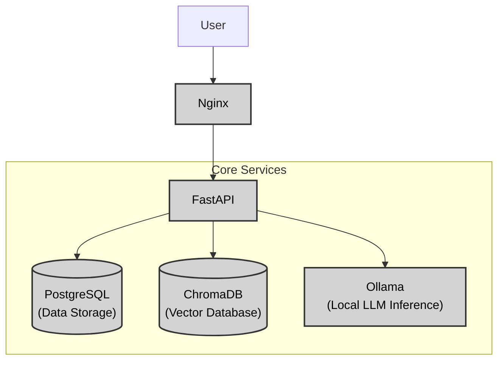
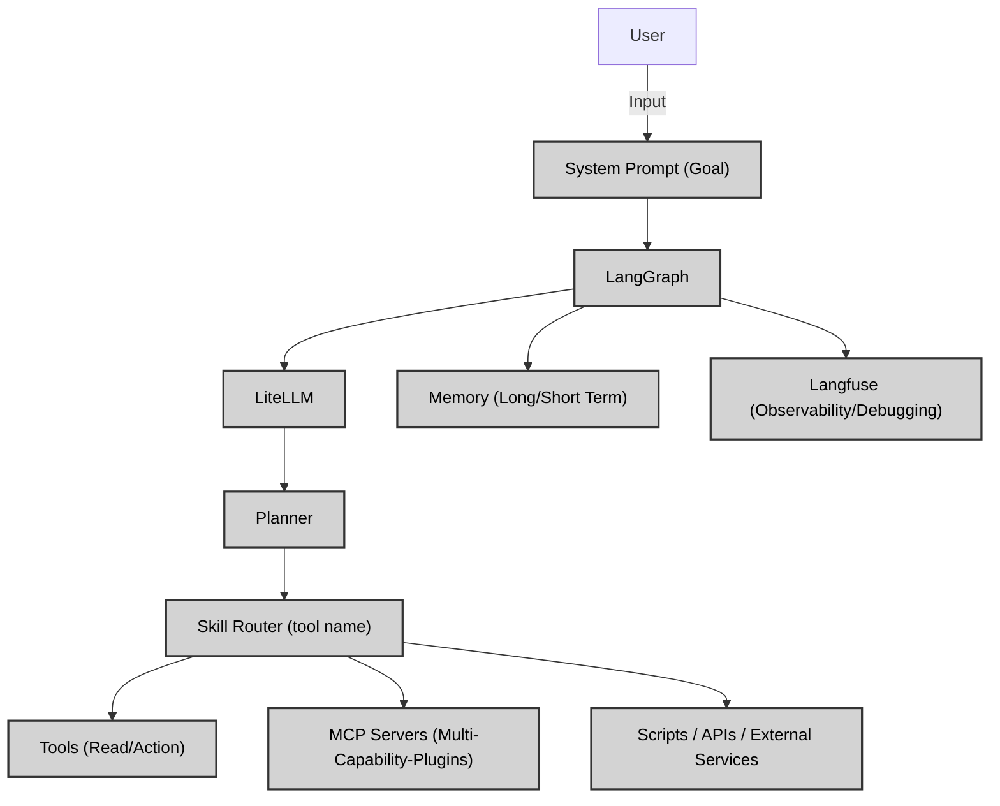

# 🤖 Polo AI - Personal AI Assistant

> A modular, local-first AI assistant inspired by Jarvis, built to automate everyday tasks through intelligent agents and tools.

---

# Vision

Jarvis is **not a chatbot**.

It is a platform capable of understanding a goal, deciding how to accomplish it, using tools, remembering information, and coordinating specialized agents.

The long-term objective is to have a personal AI assistant able to help with:

- 💼 Career Agent — Job applications & CV optimization
- 📰 News Agent — Information monitoring & summaries
- 💻 Coding Agent — Programming & development assistance
- 📅 Calendar Agent — Schedule & event management
- 📧 Email Agent — Inbox management & communication
- 📚 Knowledge Agent — Personal knowledge base & notes
- 📈 Investment Agent — Market tracking & portfolio insights
- 💰 Finance Agent — Budget tracking & financial planning
- ❤️ Health Agent — Health metrics & wellness monitoring
- ...

The architecture should make adding new capabilities as easy as creating new specific tools.

---

# Philosophy

- Local-first whenever possible
- API fallback when necessary
- Modular architecture
- Every capability is independent
- Every external action is a Tool
- Every complex workflow is an Agent
- Observable and debuggable from day one

---

# Long-Term Architecture

This section details the core technologies and services that constitute the Polo AI assistant, outlining both the frontend user interface and the backend infrastructure.

## Frontend Architecture

The frontend is built to deliver a responsive, intuitive, and modern user experience.

-   **React**: Chosen for its component-based architecture, promoting reusability and efficient rendering for complex UIs.
-   **TypeScript**: Enhances code quality with static typing, catching errors early and improving developer productivity.
-   **Vite**: Provides an extremely fast development experience with lightning-fast hot module replacement and optimized build processes.
-   **Tailwind CSS**: Enables rapid UI development using utility classes, leading to highly customizable and consistent designs.
-   **shadcn/ui**: Offers a robust set of accessible and customizable UI components, accelerating the creation of a polished user interface.

## Backend Architecture

The backend is designed for modularity, scalability, and efficient processing of AI-related tasks.

### Services Description:

-   **Nginx**: Improves security, performance, and scalability by acting as a reverse proxy, handling load balancing and SSL termination.
-   **FastAPI**: Chosen for its excellent performance, automatic data validation, and asynchronous programming support for robust AI-driven APIs.
-   **PostgreSQL**: Used for structured data storage, managing user information and configurations due to its reliability and extensibility.
-   **ChromaDB**: Essential for storing and searching vector embeddings, enabling semantic search and context retrieval for LLMs.
-   **Ollama**: Facilitates local-first AI processing by running various large language models on local hardware, ensuring privacy and reducing latency.

## Agent Architecture

### Services Description:

-   **System Prompt**: Defines the overarching goal and context for the AI assistant, guiding its behavior and task execution.
-   **LangGraph**: Orchestrates the interaction between various components, managing the state and flow of complex agentic workflows.
-   **LiteLLM**: Provides a unified interface for interacting with various Large Language Models (LLMs), abstracting away differences in API calls and model providers.
-   **Memory**: Stores historical context and learned information, enabling the agent to maintain continuity and improve its performance over time (both short-term and long-term memory).
-   **Langfuse**: Provides observability and debugging capabilities for the agent's operations, allowing for tracking, monitoring, and analyzing agent behavior.
-   **Planner**: Interprets the user's goal and generates a step-by-step plan to achieve it, leveraging available tools and information.
-   **Skill Router**: Directs the execution flow to the appropriate tools or agents based on the current step in the plan, enabling modularity and extensibility.
-   **Tools (Read/Action)**: Encapsulate specific functionalities, allowing the agent to interact with external systems or perform specific actions (e.g., reading files, calling APIs, executing scripts).
-   **MCP Servers (Multi-Capability-Plugins)**: Host and manage various plugins and capabilities, providing a robust and extensible environment for agent operations.
-   **Scripts / APIs / External Services**: Represent the underlying infrastructure and external integrations that the tools interact with to perform their functions.

## Data Architecture

# Nomenclature